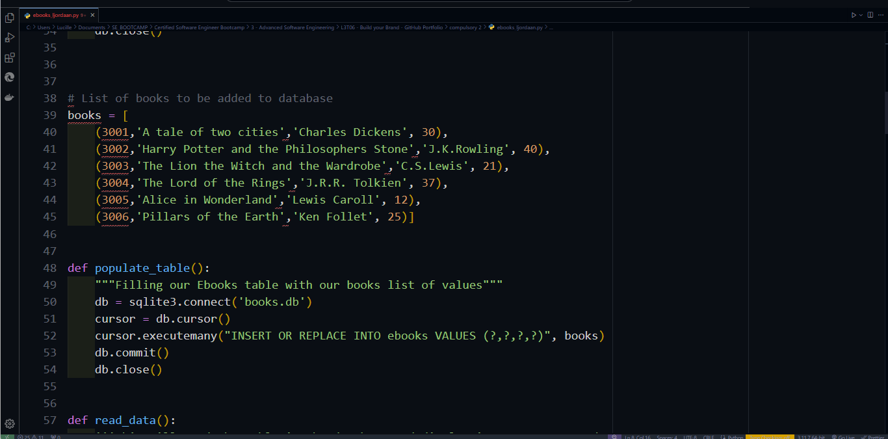

# Read-A-While Books Manager

Welcome to the Read-A-While Books Manager! This project is a simple Python program that allows users to manage a collection of books stored in an SQLite database.

## Overview

The Read-A-While Books Manager is a command-line application that offers the following functionality:

1. Add a book to the database.
2. Update information about a book.
3. Search for a book by its ID.
4. Delete a book from the database.

The program utilizes SQLite for database management and allows users to interact with the database using intuitive menu options.

## Getting Started

To get started with the Read-A-While Books Manager, follow these steps:

1. Clone the repository to your local machine:

2. Navigate to the project directory

3. Install the required dependencies
 
4. Run the program

Credits
Lucille Jordaan - Lead Developer

Resources
Hyperiondev - Software Engineering Bootcamp.
Various online resources.

